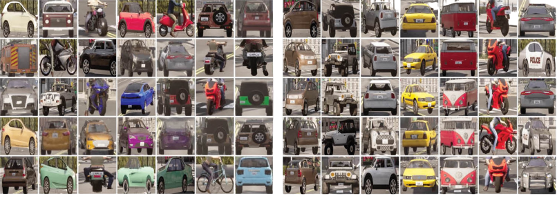

# Vehicle Re-Identification (ReID) Dataset

<p align="center"></p>

Sample images from the CARLA ReID dataset, resized to the same dimension for visualization. Figure on the left shows the variation of vehicle models and colors in the CARLA ReID dataset. CARLA ReID dataset contains four classes of vehicles such as car, truck, motorcycle, and bicycle. Figure on the right shows the camera angle variation for observing the same vehicle. Each vehicle is observed by 85 cameras located at varying distances surrounding the target vehicle.

- The file names contain the information on `vehicle id` and `camera id` separated by an underscore, necessary to train ReID model.

    - If the filename is `20220711212617_24_9.jpg`, then 20220711212617 is the datetime, 24 is the `camera id` and 9 represents the `vehicle id`. These two information is enough for training a ReID model

## Download links
The download URL of the VeRi dataset is shown here. Please note that training, gallery and query images are all inside the same zip file.

[Download VeRi dataset (CARLA)](https://www.dropbox.com/s/cg1etrs22y2xb62/VeRi_CARLA_dataset.zip?dl=0)

## Training example

- Please check `training_vehicle_reid.ipynb` Jupyter notebook to train the model or understand the training process, in general.

- Make sure that your environment is properly configured. For reference, I have provided my conda environment `mdx_reid` as a reference. Please use it as a reference only to check package versions. You may install packages using the following command:

```bash
conda env create -f mdx_reid.yml
```

## Citations
If you find our dataset useful and use it in your research, please give us a star :star: and cite the following article:

```csv
@article{kumar2022vehicle,
  title={Vehicle re-identification and trajectory reconstruction using multiple moving cameras in the CARLA driving simulator},
  author={Kumar, Ashutosh and Kashiyama, Takehiro and Maeda, Hiroya and Zhang, Fan and Omata, Hiroshi and Sekimoto, Yoshihide},
  year={2022},
  publisher={TechRxiv}
}
```
